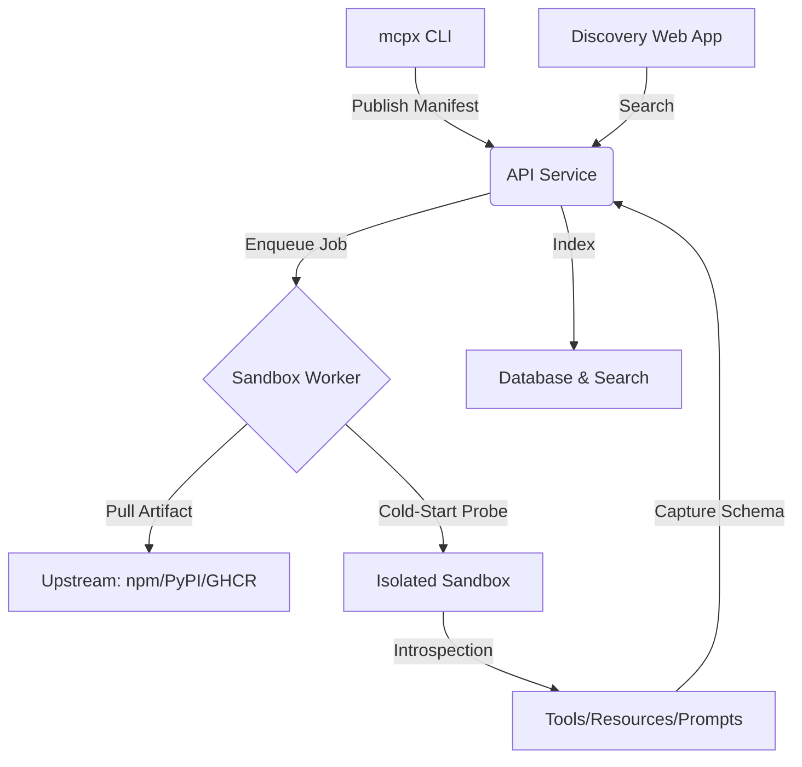

# 🚀 mcp-registry: The Reference Registry for MCP

[](https://opensource.org/licenses/MIT)
[]()
[](https://modelcontextprotocol.io)

**mcp-registry** is a production-grade, self-hostable registry and discovery platform for the [Model Context Protocol (MCP)](https://modelcontextprotocol.io). Unlike simple static lists, it provides a centralized authority for publishing, versioning, and auto-introspecting MCP servers across Python, TypeScript, Docker, and binary runtimes.

---

## 🏗️ Architecture

The platform is built as a highly decoupled micro-service architecture designed for zero-trust environments.



---

## ✨ Key Features

- **Mandatory Introspection**: Every server published is started in an isolated sandbox to verify its capabilities. If it doesn't respond to `tools/list`, it isn't published.
- **Unified CLI (`mcpx`)**: A single tool to search, install, lint, and publish servers.
- **Transport Aware**: Supports `stdio`, `sse`, and `streamable_http` transports out of the box.
- **Permission Transparency**: Manifest-level disclosure of network, filesystem, and secret requirements.
- **Self-Hostable**: Enterprise-ready with support for private catalogs and air-gapped mirroring.

---

## 🚦 Quickstart

### 1. Install the CLI
```bash
npm install -g mcpx
```

### 2. Search for Servers
```bash
mcpx search postgres
```

### 3. Initialize & Publish your Server
```bash
# Initialize a manifest (mcp.json)
mcpx init

# Validate and publish to the registry
mcpx publish .
```

---

## 🛡️ Trust & Safety Model

Registry safety is built on three layers of verification:

1.  **Introspection Check**: Validates that the server is functional and its manifest matches its runtime capabilities.
2.  **Content-Addressable Versions**: We store checksums of upstream artifacts to prevent supply-chain drift.
3.  **Sandbox Isolation**: All introspection runs in gVisor-hardened containers with default-deny network egress.

---

## 🛠️ Stack

- **API**: FastAPI 0.115+, SQLAlchemy 2.0, Pydantic 2.9
- **CLI**: Node 20+, TypeScript 5.5, Commander
- **Search**: SQL-based ILIKE (Dev) / Meilisearch (Prod)
- **Sandbox**: Official Python MCP SDK
- **Frontend**: Next.js 14 App Router, Tailwind CSS

---

## 🤝 Contributing

We welcome contributions! Please see our [CONRIBUTING.md](CONTRIBUTING.md) for guidelines on how to help build the MCP ecosystem.

1. Fork the repo.
2. Create your feature branch (`git checkout -b feature/magic`).
3. Commit your changes.
4. Push to the branch.
5. Open a Pull Request.

---

## 📄 License

Distributed under the MIT License. See `LICENSE` for more information.

---

**Built by the Community for the AI-First Future.**
